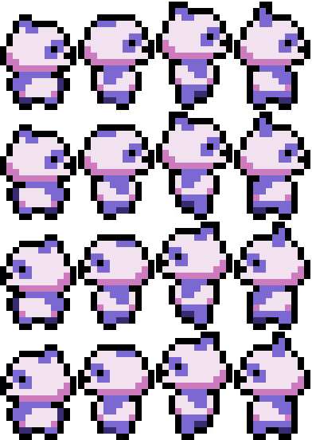
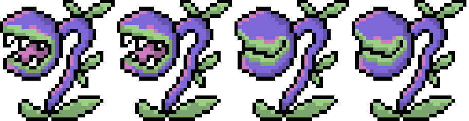

# 🎍 **Bamboo Run** 

> "Try to collect as much as possible golden leaves until reaching the end! But be careful: There are some obstacles crashing your way!"

---

## 🐼 **Play the Game**
[Click here to play Bamboo Run!](https://Kathrin787.github.io/BambooRun)

---

## 📸 **Screenshots**

### Main Gameplay:

  
  
*Panda running above the trees.*

---

### Menu and UI:

  
  
Startscreen and Startbuttons in different difficulties.

---

## 🖌️ **Spritesheets**
Below are the sprites used to create characters and objects in the game:

### Player Character:

  

---

### Enemies and NPCs:

  
  
If you know Plants vs Zombies than you might be already familiar with this plant. I thought this one would fit perfect into my game, so I redesigned it by myself.

---

## 🖊️ **Reflection**

### What went well:
- **Creative Design:** It was clear to me in the first second that I wanted to do a jump and run with a panda. And which art style fits better than a pixel art?
- **Core Mechanics:** The gameplay was fun to adjust. I had the opportunity to customize it to what felt best to me.

### Challenges:
- **Time Constraints:** At the beginning I planned more features and stuff, but unfortunately I didn't have enough time because I was filling my time with troubleshooting.
- **Bug Fixes:** Sometimes collisions didn't work and I was searching a long time to fix them, just to find a missing letter, semicolon or something else.

### Lessons Learned:
- **Prototyping Matters:** Early testing helped me with searching and finding any issues immediately.
- **Keep it Simple:** I also learned that I don't have to do everything perfectly right away, I can always change things and improve them later.
